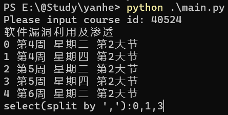

# BIT_yanhe_download

## 介绍

本项目可下载[延河课堂 (yanhekt.cn)](https://www.yanhekt.cn/recordCourse)中的课程视频。延河课堂是北京理工大学的在线课堂，提供了大量的课程视频，但是没有提供下载功能。本项目可以下载指定课程的视频录像和屏幕信号，包括无权限的课程。

欢迎提出建议和star！

## 使用：下载指定课程

[下载并解压](https://github.com/AuYang261/BIT_yanhe_download/releases/latest/download/yanhe.zip)。

在[延河课堂 (yanhekt.cn)](https://www.yanhekt.cn/recordCourse)中找到想下载的课程，以链接为https://www.yanhekt.cn/course/40524 的课程为例，复制地址栏最后的五位编号40524。注意是课程列表的链接（以`yanhekt.cn/course/五位编号`开头），不是视频界面的链接（以`yanhekt.cn/session/六位编号`开头）。


双击运行`main.exe`（Release中的）或`run.bat`文件，并输入你想下载的课程编号(40524)。输出课程视频列表：



输入想下载的视频编号，用英文逗号(,)分隔，回车。接着选择下载video视频录像（即教室后的摄像头录像）还是下载screen信号（即教室电脑的屏幕），默认为视频录像。回车即开始下载：


下载完成的文件在`output/`目录下以`课程名-video/screen`格式命名的文件夹中。


## 依赖

* ffmpeg，已在Release中提供。

*若想用python环境运行，需安装这些依赖*

* python，[下载](https://www.python.org/ftp/python/3.9.4/python-3.9.4-amd64.exe)并安装

* python第三方库requests。打开命令行（按win+r，在打开的窗口中输入cmd，回车），运行如下命令安装：

  ```bash
  pip install -r requirements.txt
  ```

## 注意

* 需要关闭本机上的代理，否则会提示类似`check_hostname requires server_hostname`的报错信息。
* 可以下载无权限的课程，只要知道课程链接（中的课程编号）就行。

## 打包

如果想要运行时不依赖python环境，可将python程序打包成可执行文件。Release中已打包。

使用如下命令打包：

```bash
Pyinstaller -F main.py
```
